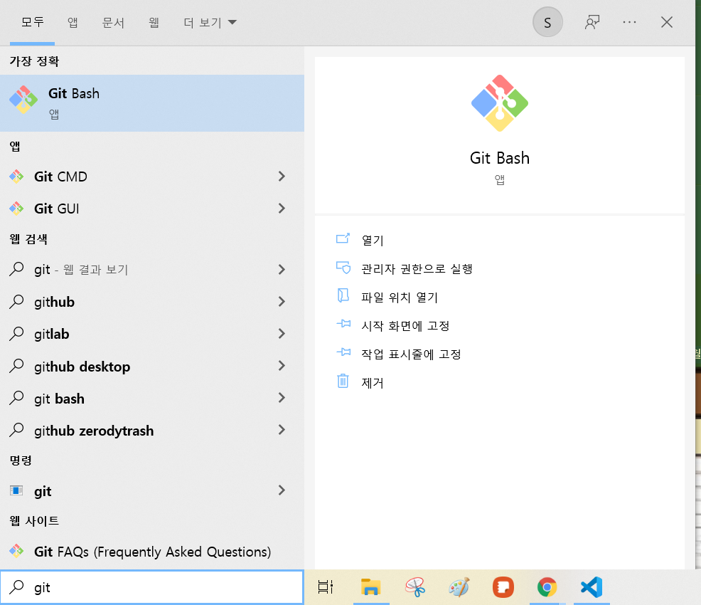
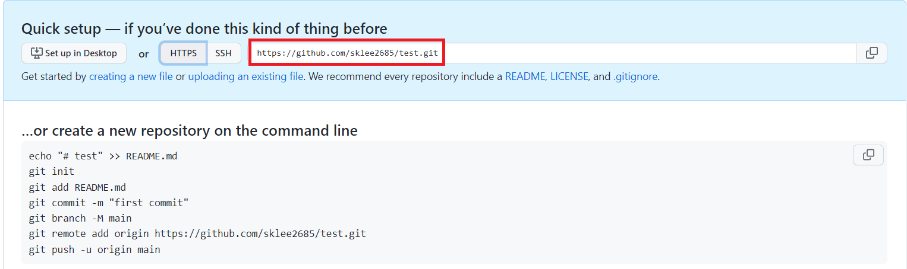
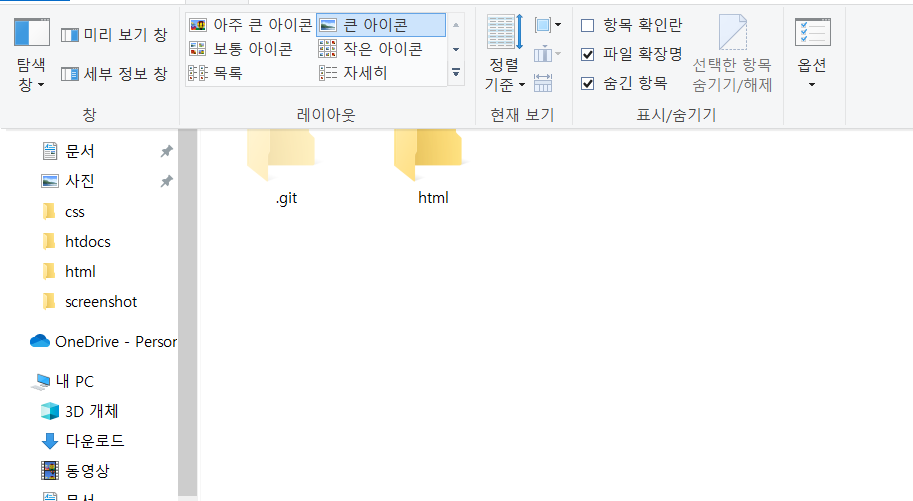
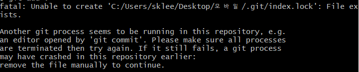

# 기본 사용법(github)
## 기본셋팅
먼저 GitHub에 가입하기 위해 <a href="https://github.com">github.com</a> 해당 사이트에 방문해 회원 가입을 해준다.(이때 회원 가입 시 입력하는 칸에 이메일이 있는데 기억해두기, 또 이메일은 나중에 다시 setting에 들어가면 바꿀 수 있다.)
이메일 인증까지 끝내면

해당 페이지가 나오는데, 왼쪽부터 저장소 생성, 오거니제이션 생성, GitHub 학습 이다.

그 다음으로 Git이라는 인스톨러를 사용해야 하기 때문에 각 컴퓨터에 맞는 os를 설치해 줘야한다. 

window

https://git-scm.com/ Git 공식 웹사이트에 접속해 Git을 다운로드한다.

다운이 끝나고 환경설정을 위해 Git Bash를 실행시켜 준다.

실행을 하면 나오는 터미널에 
`git config --global user.name "사용자 이름"`
`git config --global user.email github가입 시 사용한 이메일주소`
해당 코드를 입력해주고, `git config --list`를 입력해 'user.name','user.email'를 확인해봐서 방금 입력한 게 입력되어있으면 성공이다.

## Github에 파일 업로드하기

먼저 업로드하기 전 먼저 생성한 Repository로 이동하여 HTTPS에 해당하는 url을 복사해줍니다.

이제 업로드하려고 하는 파일 위치에서 Git Bashf를 실행하고 다음 코드를 입력한다.

1. `git init`:맨 처음에 프로젝트를 올릴때 꼭 해줘야함 파일 업로드를 하고 다음 파일을 올릴땐 사용X 
이것을 입력하면 해당 디렉터리 안에 .git이라는 폴더가 생성된다. (숨김항목을 체크해야 보임)

2. `git add `:어떤 파일을 추가할지 찾아봄(마지막에 .을 추가하면 해당 디렉토리에 있는 파일 전부를 추가함)

3. `git commit -m "파일이름"`: 파일 히스토리를 만들어줌(수정 계속 가능)

4. `git remote add origin 아까 복사한 url 붙여넣기`
입력후 `git remote -v`를 입력해 github에 자신이 만든 저장소 이름이 나오면 성공

5. `git push origin main`: 아까 `git commit -m "파일이름"` 했던 파일들을 github에 업로드를 시작함

다음 업로드부터는 2,3,5번만 하면 업로드 됨

# 오류및 해결방안
git을 사용해  gihub에 파일을 업로드할 때
`git commit -m "이름" `해당 코드에서 `-m`을 빼먹음으로써 
.git 파일 안에 있는 index.lock 파일에 오류가 발생했음
그럼으로 인해 아래와 같은 사진이 출력됨

해당 오류가 나오면 `commit`및 `push`명령어가 실행되지 X

* [해결 방법]
1. 문제가 생긴 Git 저장소 폴더 상단으로 이동

2. 해당 폴더를 루트로 하여 Terminal 및 컨맨트 툴을 이용해 `cd "git 저장소 폴더 경로"` 이 명령어를 통해 해당 폴더로 이동 후
(.git 파일이 있는 곳에서 터미널을 여는것이 더 편함)

3. 문제가 되는 index.lock 파일을 `rm -f ./.git/index.lock`를 통해 삭제

4. 다시  `commit`및 `push`명령어가 실행