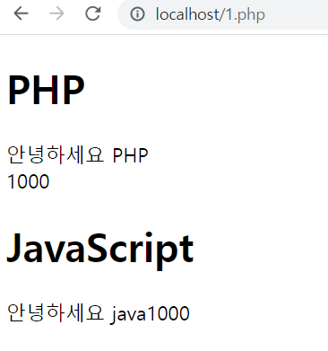
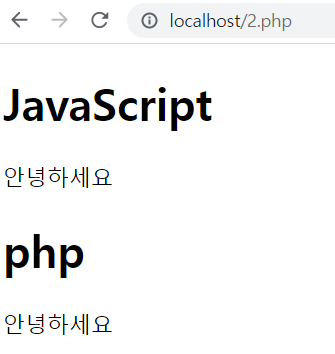
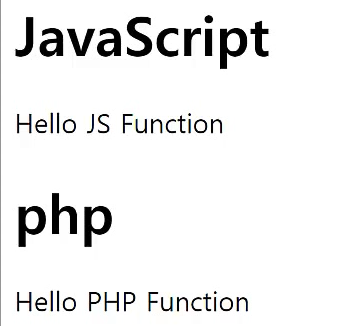
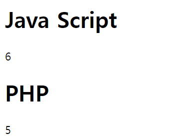

css 파일: css연습및 메인홈페이지에 관련코딩이 있음

php 파일: 메인 홈페이지를 php파일로 변환함

phpjs 파일: php언어와 javascript언어가 웹상에서 어떤 코드 차이가 있는지 비교함

screenshot 파일: 메인 홈페이에서 사용된 사진의 모음집

script_btn.js : 다크모드 전환 코드

template.html : html파일의 기본 구성을 만들어 둔 코드 (복붙용)

https://sklee2685.tistory.com/
지금 까지 배운 내용 정리해둔 싸이트

# html 문법 정리
> `<strong></strong>`

* `<strong></strong>`을 사용하게 되면 저 strong사이에 있는 문장들이 굵은 문자로 강조되어서 나옴

  ex) 안녕하세요. --> <strong>안녕하세요.</strong>

> a (링크를 나타내는 태그)

`<a>이정호</a>` 이런 식으로 나타내면 웹페이지는 '이정호' 이 부분을 사용자가 클릭할 수 있는 링크로 인식한다. ex)<a>이정호</a>

단, 현재 이 코드는 완벽한 상태가 아니다. 본래라면 이 해당 링크를 클릭하면 거기에 해당하는 문서로 이동해야 하지만 그 부분이 아직 입력되지 않았다.

`<a herf"문서 주소">이정호</a>` 이런 식으로 입력했을 경우에 이제 우리들이 알고 있는 링크의 역할을 하게 된다.
예를 들어 저 '문서 주소' 부분에 네이버로 이정호를 검색했을 때의 주소를 입력하면 (<a href="https://search.naver.com/search.naver?where=nexearch&sm=top_hty&fbm=1&ie=utf8&query=%EC%9D%B4%EC%A0%95%ED%98%B8" target="_blank">이정호</a><--클릭) 처럼 작동하게 된다.

* `target="_blank"`이라는 속성을 입력하면 새로운 창에서 링크를 여는것이고,
* `target="_self"`를 입력하면 사용자가 사용중인 현재 창에 링크를 로딩한다.
>`<h1></h1>`, `<h2></h2>`

`<h1></h1>`, `<h2></h2>`둘다 문서의 주제어(제목)을 표시할때 이용함

사용시 다음 아래처럼 나옴
<h1>제목1(h1 사용)</h1>
<h2>제목2(h2 사용)</h2>

> list 

`<li> </li>`를 사용하게 된다면
<li>html</li>
<li>css</li>
<li>JavaScript</li>
이런 식으로 목록(List) 형식으로 나타낼 수 있다.

여기서 별도의 구분을 위해 `<ul></ul>`이라는 태그이다.
(ul==<**u**nordered **l**ist)

또한 순서 1. 2. 3. 이런 식으로 나타내기 위해선 `<ol></ol>`이라는 태그를 사용하면 된다.
|태그|예시|
|:---:|:--:|
|`<li></li>`|<li>html</li><li>css</li><li>JavaScript</li>|
|`<ul></ul>`|<ul><li>html</li><li>css</li></ul> <ul><li>JavaScript</li></ul>|
|`<ol></ol>`|<ol><li>html</li><li>css</li><li>JavaScript</li></ol>|

> head, body, html 태그 

`<head></head>`: 해당 문서의 정보를 담고 있는 태그

`<body></body>`: 해당 문서의 내용을 담고 있는 태그

`<html></html>`: html 태그 안쪽에 있는 태그들이 html의 문서이다를 웹브라우저에 알려주는 역할을 함

* 기본적인 틀
    ```html
    <!DOCTYPE html> 
    <!--어떤 표준안을 따라 만든 것 인지 알려줌 
    (없어도 작동은 함 단, 정상작동을 위해 표기하는 것이 좋음)-->
    <html>
      <head>
        정보(제목, 문자 코드 등)
        ex) <meta charset="utf-8">
        utf-8이라는 방식의 문자 코드로 저장되어 있는 문서라고 알려줌
                (해당 코드가 없으면 한글이 깨져서 나올 수도 있음)
      </head>
      <body>
            내용(말 그대로 내용)
      </body>
    </html>
    ```

>Semantic Web(의미가 잘 드러나는 웹)

* `<nav></nav>`이라는 태크를 사용하면 이 태그 안에 있는 것이 내비게이션을 위한 리스트라는 것을 웹페이지에 알려줌
(이 웹사이트를 탐색하기 위한 정보라는 것을 의미)

* `<header></header>`이라는 태그는 이 해당 글의 핵심임을 나타내기 위한 것<div style="text-aling:left">(`<h1></h1>`으로 사용해도 크게 문제는 없지만, 분명하게 드러나게 하기 위해서 사용)</div>


* `<article></article>` 해당 태그를 사용해 이 문서의 본문이라는 점을 나타내기 위해 사용함
<br><br/>

# CSS(디자인을 위한 언어) 기본 문법
<span style="Color:red">C</span>ascading <span style="Color:red">S</span>tyle <span style="Color:red">S</span>heet: HTML이나 XML(XML의 방언인 SVG, XHTML 포함)로 작성된  **문서의 표시 방법을 기술하기 위한 스타일 시트 언어**입니다. CSS는 요소가 화면, 종이, 음성이나 다른 매체 상에 어떻게 렌더링 되어야 하는지 지정합니다.
[<a href="https://developer.mozilla.org/ko/docs/Web/CSS" target="_self">출처</a>]

* `<style></style>` 태그 사용법
  ```html
  <!DOCTYPE html>
  <html>
      <head>
          <meta charset="utf-8">
          <style>
            h1,h3{
              color:red;
              font-size:10px;
            }
            h2{
              color:yellow;
              text-decoration:underline;
            }
          </style>
      </head>
      <body>
          <h1>CSS</h1>
          <h2>JavaScript</h2>
          <h3>HTML</h3>
      </body>
  </html>
  ```
  해당 코드를 통해 `<style></style>`의 코드 안에 있는 코드로 인해 다음 같은 결과가 나옴
  
  |`<style></style>`적용 전|`<style></style>`적용 후|
  |:---:|:---:|
  |||
 

  이때 `h1{color:red}`에서 h1은 **선택자(selector)** 으로 누구에게 적용시킬 것인가를 나타내기 때문에 선택자라고 함
  또, {}안에 있는 것은 **서술(description)** 으로 어떤 효과를 선택자에게 적용할 것인지를 나타내고 있는 곳이다.
  단, 서술자가 여러 개 있을 때 ;(세미콜론)을 사용해 서술의 속성을 구분함.

* 어떤 태그 안에 있는 선택자에 효과 주기
```html
<!DOCTYPE html>
  <html>
      <head>
          <meta charset="utf-8">
          <style>
            header h1{
              border:1px solid red;
            }
          </style>
          <!--border:1px은 테두리를 의미하는 코딩-->
      </head>
      <body>
        <header>
          <h1>CSS</h1>
        </header>
      </body>
  </html>
```


다음 사진처럼 어떤 태그에 상위 태그가 또 있어도 효과를 부여할 수 있다.
<br></br>
>CSS-박스 모델

모든 HTML 요소는 박스(box) 모양으로 구성되며, 이것을 박스 모델(box model)이라고 부릅니다.
박스 모델은 HTML 요소를 패딩(padding), 테두리(border), 마진(margin), 그리고 내용(content)으로 구분합니다.


[<a href="http://tcpschool.com/css/css_boxmodel_boxmodel">출처</a>]

1. 내용(content) : 텍스트나 이미지가 들어있는 박스의 실질적인 내용 부분입니다.

2. 패딩(padding) : 내용과 테두리 사이의 간격입니다. 패딩은 눈에 보이지 않습니다.

3. 테두리(border) : 내용와 패딩 주변을 감싸는 테두리입니다.

4. 마진(margin) : 테두리와 이웃하는 요소 사이의 간격입니다. 마진은 눈에 보이지 않습니다.


```html
<!DOCTYPE html>
  <html>
      <head>
          <meta charset="utf-8">
          <style>
              li{
                  border:1px red solid;
                  margin: 30px;
              }
              #box{
                  border: 1px blue dotted;
                  padding: 30px;
              }
          </style>
      </head>
      <body>
        <ul>
            <li>html</li>
            <li>css</li>
            <li id="box">box model</li>
        </ul>
      </body>
  </html>
```
결과


위의 코드에서처럼 `li{~}`를 통해 사용할 수도 있지만, `<li id="box">box model</li>`에서처럼 id 값을 따로 지정한 후 `<style>`에서 #id이름을 입력하는 것으로도 사용 가능하다.

>float

문서에서 사진과 그림이 있을 때, 그림을 왼쪽이나 오른쪽에 띄워서 정렬하거나 각 객체를 오른쪽이나 왼쪽으로 정렬하여 전체 문서를 배치(layout)할 때도 사용함
|float 속성값|의미|
|:---:|:---:|
|none|띄우지 않음(기본값)|
|left|왼쪽에 띄움|
|right|오른쪽에 띄움|
|initial|기본값으로 설정함|
|inherit|부모 요소로부터 상속함|
<br></br>
* float 적용해보기

|적용 전|적용 후|
|:---:|:---:|
|||


<br></br>

# JavaScript & PHP


> html & css 와 다른점

html & css는 정적인 언어이다.
한번 html이나 css에 입력을 하면 사용자가 무엇을 하든 변경되지X

하지만, JavaScript & PHP은 동적인 언어로, 사용자가 버튼을 누르거나
정보를 입력해 서버로 전송하면 저장되는 등 상황에 따라 다르게 작동하는 언어가 JavaScript & PHP 이다.
<br></br>

> JavaScript

클라이언트 단에서 웹 페이지가 동작하는 것을 담당한다.웹 페이지를 자동차에 비유하자면, HTML은 자동차의 뼈대, CSS는 자동차의 외관, JavaScript는 자동차의 동력이라고 볼 수 있다.

`<script></script>` javascript가 시작된고 끝난다는 것을 **javascript의 엔진**에 알려주는 역할을 함

그리고 무언가를 출력할 때에는 `document.write()`를 사용한다.
<br></br>

>PHP

PHP웹 서버에 요청을할 때 해당 스크립트를 프로세서가 실행한 뒤 종료되고 그다음 새 요청이 들어오면 처음부터 다시 시작되는 방식이다. 그 때문에 PHP에서 싱글톤 패턴을 구현하면 객체는 1회 요청에 의한 작업이 끝날 때까지만 유지된다.
(html이랑 기본적으로 똑같이 실행이됨)

`<?php ~ ?>`php가 시작된고 끝난다는 것을 **php의 엔진**에 알려주는 역할을 함

그리고 php에서 무언가를 출력할 때에는 `echo`를 사용하고,(print문 이라고 생각하면 됨) 문자를 출력하기 위해서 " "를 사용한다.
ex) `echo "Hello world";`를 `<?php ~ ?>` 안에 입력하면 웹에서는 Hello world가 출력된 것을 볼 수 있다.


* 문자및 숫자

  ||Java Script|PHP|
  |:---:|:---:|:---:|
  |문자|"안녕하세요"|"안녕하세요"|
  |숫자|1000|1000|
  |문자 더하기|"1"+"2"|"1"."2"|


1.php실행 결과

## 변수

변수: 바뀔 수 있는 어떤 값

|Java Script|PHP|
|:---:|:---:|
|name="";|$name="";|

```html
<!DOCTYPE html>
<html>
    <head>
        <meta charset="utf-8">
    </head>

    <body>
        <h1>JavaScript</h1>
        <script>
            name="하세요";
            document.write("안녕"+name);
        </script>

        <h1>php</h1>
        <?php
            $name="하세요";
            echo "안녕".$name;
        ?>
    </body>
</html>
```
결과



## Java Script 변수선언 방식-var, let, const 차이점 5가지

1. 중복선언 가능 여부

2. 재할당 가능 여부

3. 변수 스코프 유효범위

4. 변수 호이스팅 방식

5. 전역객체 프로퍼티 여부

* var : 중복 선언이 가능하다.
var로 선언한 변수는 중복해서 선언(+초기화)가 가능하다.
이 경우, 마지막에 할당된 값이 변수에 저장된다.
단, 초기화 없이 선언만 한 경우엔 선언문 자체가 무시된다.(에러는 발생하지 않음)

* const, let : 중복 선언 불가능
 이미 선언한 변수를 다시 선언할 경우, 에러가 발생함
(var에 비해서 코드의 안정성을 높음)
<br></br>
## 파일 불러오기
`file_get_contents("불러올 파일의 이름");`
다음과 같은 코드를 사용하면 다른 파일의 내용을 불러올 수 있다.
예를 들어 1.txt 파일에 "Hello"라는 내용의 파일이 있다면
```html
<!DOCTYPE html>
<html>
    <head>
        <meta charset="utf-8">
    </head>
    
    <body>
    <?php
    echo file_get_contents("1.txt");
    ?>
    </body>
</html>
```
이와 같은 PHP코드를 통해 1.txt 파일에 있는 내용을 echo를 통해 홈페이지에 출력할 수 있다.

여기서 2.txt 파일을 생성한 후 내용으로 "World"를 입력한 후, 코드를 아이디 값에 따라 다르게 한다면
```html
<!DOCTYPE html>
<html>
    <head>
        <meta charset="utf-8">
    </head>
    
    <body>
    <?php
      echo file_get_contents($_GET[id].".txt");
    ?>
    </body>
</html>
```
id 값에 따라 "Hello"와 "World"가 나오는 걸 확인해 볼 수 있다.
<br></br>

## 배열

배열: 서로 연관되어 있는 여러 가지 정보를 배열이라고 부르는 그릇에 담아 관리할 수 있음

예시
||Java Script|PHP|
|:--:|:---:|:---:|
|선언|list=new Array("one","two","three");|$list array("one","two","three");|
||list[0];|$list[0];|
|출력|document.write(list[2]);|echo $list[1];|
|결과|three|two|

## 반복문

Java Script

ex)
```html
<!DOCTYPE html>
<html>
    <head>
        <meta charset="utf-8">
    </head>
    
    <body>
      <script>
        list=new Array("안","녕","하","세","요");
        i=0;
        while(i<list.length){
          document.write("<li>"+list[i]+"</li>");
          i=i+1;
        }
      </script>
    </body>
</html>
```
PHP

ex)
```php
<!DOCTYPE html>
<html>
    <head>
        <meta charset="utf-8">
    </head>
    
    <body>
    <ul>
      <?php
        $list=array("안","녕","하","세","요");
        $i=0;
        while($i < count($list)){
          echo "<li>"+.$list[$i]."</li>";
          $i=$i+1;
        }
      ?>
    </ul>
    </body>
</html>
```
|결과|
|:--:|
|<li>안</li><li>녕</li><li>하</li><li>세</li><li>요</li>|

## 함수의 기본 문법

||Java Script|PHP|
|:--:|:---:|:---:|
|선언|function function_name(){내용}|function function_name(){내용}|
|호출|function_name();|function_name();|

ex)
```html
<!DOCTYPE html>
<html>
    <head>
        <meta charset="utf-8">
    </head>
    
    <body>
        <h1>Java Script</h1>
        <Script>
            function a(){
              //a라는 함수를 만들고, 아래의 코드를 추가함
                document.write("Hello JS Function");
            }
            a();
            //a(); 아까 만들었던 함수를 호출함으로써 함수a에 있던 코드가 실행됨 -->Hello JS Function이라는 문장이 출력됨
        </Script>

        <h1>PHP</h1>
        <?php
        <!--b 라는 함수를 만들고, 아래의 코드를 추가함-->
        function b(){
            echo "Hello PHP Function";
        }
        b();
        <!--아까 만들었던 함수를 호출함으로써 함수b에 있던 코드가 실행됨 ==> Hello PHP Function이라는 문장이 출력됨-->
        ?>
    </body>
</html>
```


## 함수의 문법-입 출력
```html
<!DOCTYPE html>
<html>
    <head>
        <meta charset="utf-8">
    </head>
    
    <body>
        <h1>Java Script</h1>
        <Script>
            function a(input){
                document.write(input+input);
                //return input+input;
            }
            a(3);
            //document.write(a(3));
            //주석처리한 코드로 해도 동일한 값이 출력됨
        </Script>

        <h1>PHP</h1>
        <?php
        function b($input){
            echo $input;
            <!--return $input;-->
        }
        b(5);
        <!--echo b(5);-->
        ?>
    </body>
</html>
```


# UI vs API

UI(<span style="Color:red">U</span>ser <span style="Color:red">I</span>nterface)

사람(사용자)과 사물 또는 시스템, 특히 기계, 컴퓨터 프로그램 등 사이에서 의사소통을 할 수 있도록 일시적 또는 영구적인 접근을 목적으로 만들어진 물리적, 가상적 매개체이다.

API(<span style="Color:red">A</span>pplication <span style="Color:red">P</span>rogramming <span style="Color:red">I</span>nterface)

컴퓨터나 컴퓨터 프로그램 사이의 연결으로 일종의 소프트웨어 인터페이스이며 다른 종류의 소프트웨어에 서비스를 제공함
<br></br>

# 데이터베이스-MySQL
세계에서 가장 많이 쓰이는 오픈 소스의 관계형 데이터베이스 관리 시스템
(= 엑셀이랑 비슷하게 사용함)

데이터베이스랑 엑셀과 차이점이라하면 SQL(<span style="Color:red">S</span>tructured <span style="Color:red">Q</span>uery <span style="Color:red">L</span>anguage)의 유무의 차이이다. 

여기서 SQL 이란? 컴퓨터에게 구조화된 정보를 질의(질문) 하는 프로그래밍 언어를 의미한다.

또, MySQL은 Client와 Server의 구성을 가지고 있다.

여기서 클라이언트 가 서버에서 어떤 정보를 요청하면, 서버는 클라이언트에게 저장되어 있는 정보를 가지고 와서 보내주게 된다.
해당 데이터베이스를 사용하기 위해 mySQL를 설치하면 설치되어 있는 mySQL montior를 이용해 데이터베이스를 제어할 수 있다.(단, 사용하기 좀 어렵다.)

## [Window]
이제 mySQL montior를 실행시키기 위해 "명령 프롬프트"를 실행한 후
`mysql -hlocalhost -uroot -p`를 입력하면 "Enter password:"라는 문구가 나오는데 여기에 사용자가 설정했던 비밀번호를 입력하면 된다.

* 데이터베이스 장점
1. 데이터 중복 최소화
2. 데이터 공유
3. 일관성, 무결성, 보안성 유지
4. 최신의 데이터 유지
5. 데이터의 표준화 가능
6. 데이터의 논리적, 물리적 독립성
7. 용이한 데이터 접근
8. 데이터 저장 공간 절약

* 데이터베이스 단점
1. 데이터베이스 전문가 필요
2. 많은 비용 부담
3. 데이터 백업과 복구가 어려움
4. 시스템의 복잡함
5. 대용량 디스크로 엑세스가 집중되면 과부하 발생
