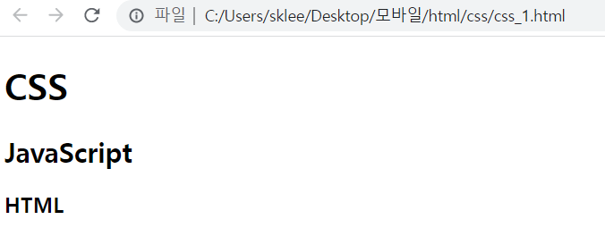
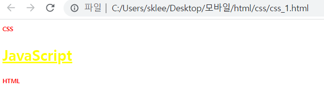
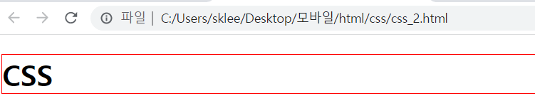
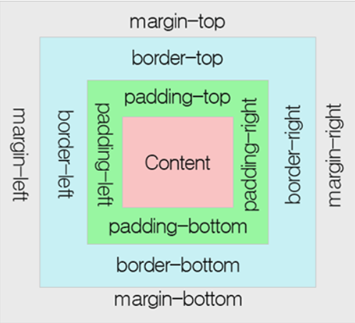
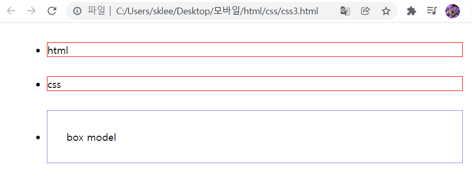
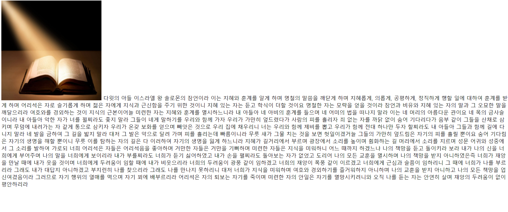
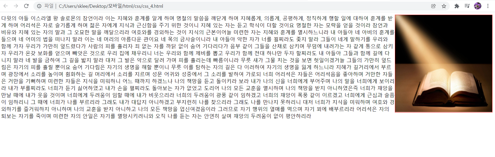

# html 문법 정리
> `<strong></strong>`

* `<strong></strong>`을 사용하게 되면 저 strong사이에 있는 문장들이 굵은 문자로 강조되어서 나옴

  ex) 안녕하세요. --> <strong>안녕하세요.</strong>

> a (링크를 나타내는 태그)

`<a>이정호</a>` 이런 식으로 나타내면 웹페이지는 '이정호' 이 부분을 사용자가 클릭할 수 있는 링크로 인식한다. ex)<a>이정호</a>

단, 현재 이 코드는 완벽한 상태가 아니다. 본래라면 이 해당 링크를 클릭하면 거기에 해당하는 문서로 이동해야 하지만 그 부분이 아직 입력되지 않았다.

`<a herf"문서 주소">이정호</a>` 이런 식으로 입력했을 경우에 이제 우리들이 알고 있는 링크의 역할을 하게 된다.
예를 들어 저 '문서 주소' 부분에 네이버로 이정호를 검색했을 때의 주소를 입력하면 (<a href="https://search.naver.com/search.naver?where=nexearch&sm=top_hty&fbm=1&ie=utf8&query=%EC%9D%B4%EC%A0%95%ED%98%B8" target="_blank">이정호</a><--클릭) 처럼 작동하게 된다.

* `target="_blank"`이라는 속성을 입력하면 새로운 창에서 링크를 여는것이고,
* `target="_self"`를 입력하면 사용자가 사용중인 현재 창에 링크를 로딩한다.
>`<h1></h1>`, `<h2></h2>`

`<h1></h1>`, `<h2></h2>`둘다 문서의 주제어(제목)을 표시할때 이용함

사용시 다음 아래처럼 나옴
<h1>제목1</h1>
<h2>제목2</h2>

>list 

`<li> </li>`를 사용하게 된다면
<li>html</li>
<li>css</li>
<li>JavaScript</li>
이런 식으로 목록(List) 형식으로 나타낼 수 있다.

여기서 별도의 구분을 위해 `<ul></ul>`이라는 태그이다.
(ul==<**u**nordered **l**ist)

또한 순서 1. 2. 3. 이런 식으로 나타내기 위해선 `<ol></ol>`이라는 태그를 사용하면 된다.
|태그|예시|
|:---:|:--:|
|`<li></li>`|<li>html</li><li>css</li><li>JavaScript</li>|
|`<ul></ul>`|<ul><li>html</li><li>css</li></ul> <ul><li>JavaScript</li></ul>|
|`<ol></ol>`|<ol><li>html</li><li>css</li><li>JavaScript</li></ol>|

> head, body, html 태그 

`<head></head>`: 해당 문서의 정보를 담고 있는 태그

`<body></body>`: 해당 문서의 내용을 담고 있는 태그

`<html></html>`: html 태그 안쪽에 있는 태그들이 html의 문서이다를 웹브라우저에 알려주는 역할을 함

* 기본적인 틀
    ```html
    <!DOCTYPE html> 
    <!--어떤 표준안을 따라 만든 것 인지 알려줌 
    (없어도 작동은 함 단, 정상작동을 위해 표기하는 것이 좋음)-->
    <html>
    <head>
        정보(제목, 문자 코드 등)
        ex) <meta charset="utf-8">
        utf-8이라는 방식의 문자 코드로 저장되어 있는 문서라고 알려줌
                (해당 코드가 없으면 한글이 깨져서 나올 수도 있음)
    </head>
    <body>
            내용(말 그대로 내용)
    </body>
    </html>
    ```

>Semantic Web(의미가 잘 드러나는 웹)

* `<nav></nav>`이라는 태크를 사용하면 이 태그 안에 있는 것이 내비게이션을 위한 리스트라는 것을 웹페이지에 알려줌
(이 웹사이트를 탐색하기 위한 정보라는 것을 의미)

* `<header></header>`이라는 태그는 이 해당 글의 핵심임을 나타내기 위한 것<div style="text-aling:left">(`<h1></h1>`으로 사용해도 크게 문제는 없지만, 분명하게 드러나게 하기 위해서 사용)</div>


* `<article></article>` 해당 태그를 사용해 이 문서의 본문이라는 점을 나타내기 위해 사용함
<br><br/>
# CSS(디자인을 위한 언어) 기본 문법
<span style="Color:red">C</span>ascading <span style="Color:red">S</span>tyle <span style="Color:red">S</span>heet: HTML이나 XML(XML의 방언인 SVG, XHTML 포함)로 작성된  **문서의 표시 방법을 기술하기 위한 스타일 시트 언어**입니다. CSS는 요소가 화면, 종이, 음성이나 다른 매체 상에 어떻게 렌더링 되어야 하는지 지정합니다.
[<a href="https://developer.mozilla.org/ko/docs/Web/CSS" target="_self">출처</a>]

* `<style></style>` 태그 사용법
  ```html
  <!DOCTYPE html>
  <html>
      <head>
          <meta charset="utf-8">
          <style>
            h1,h3{
              color:red;
              font-size:10px;
            }
            h2{
              color:yellow;
              text-decoration:underline;
            }
          </style>
      </head>
      <body>
          <h1>CSS</h1>
          <h2>JavaScript</h2>
          <h3>HTML</h3>
      </body>
  </html>
  ```
  해당 코드를 통해 `<style></style>`의 코드 안에 있는 코드로 인해 다음 같은 결과가 나옴
  
  |`<style></style>`적용 전|`<style></style>`적용 후|
  |:---:|:---:|
  |||
 

  이때 `h1{color:red}`에서 h1은 **선택자(selector)** 으로 누구에게 적용시킬 것인가를 나타내기 때문에 선택자라고 함
  또, {}안에 있는 것은 **서술(description)** 으로 어떤 효과를 선택자에게 적용할 것인지를 나타내고 있는 곳이다.
  단, 서술자가 여러 개 있을 때 ;(세미콜론)을 사용해 서술의 속성을 구분함.

* 어떤 태그 안에 있는 선택자에 효과 주기
```html
<!DOCTYPE html>
  <html>
      <head>
          <meta charset="utf-8">
          <style>
            header h1{
              border:1px solid red;
            }
          </style>
          <!--border:1px은 테두리를 의미하는 코딩-->
      </head>
      <body>
        <header>
          <h1>CSS</h1>
        </header>
      </body>
  </html>
```


다음 사진처럼 어떤 태그에 상위 태그가 또 있어도 효과를 부여할 수 있다.
<br></br>
>CSS-박스 모델

모든 HTML 요소는 박스(box) 모양으로 구성되며, 이것을 박스 모델(box model)이라고 부릅니다.
박스 모델은 HTML 요소를 패딩(padding), 테두리(border), 마진(margin), 그리고 내용(content)으로 구분합니다.


[<a href="http://tcpschool.com/css/css_boxmodel_boxmodel">출처</a>]

1. 내용(content) : 텍스트나 이미지가 들어있는 박스의 실질적인 내용 부분입니다.

2. 패딩(padding) : 내용과 테두리 사이의 간격입니다. 패딩은 눈에 보이지 않습니다.

3. 테두리(border) : 내용와 패딩 주변을 감싸는 테두리입니다.

4. 마진(margin) : 테두리와 이웃하는 요소 사이의 간격입니다. 마진은 눈에 보이지 않습니다.


```html
<!DOCTYPE html>
  <html>
      <head>
          <meta charset="utf-8">
          <style>
              li{
                  border:1px red solid;
                  margin: 30px;
              }
              #box{
                  border: 1px blue dotted;
                  padding: 30px;
              }
          </style>
      </head>
      <body>
        <ul>
            <li>html</li>
            <li>css</li>
            <li id="box">box model</li>
        </ul>
      </body>
  </html>
```
결과


위의 코드에서처럼 `li{~}`를 통해 사용할 수도 있지만, `<li id="box">box model</li>`에서처럼 id 값을 따로 지정한 후 `<style>`에서 #id이름을 입력하는 것으로도 사용 가능하다.

>float

문서에서 사진과 그림이 있을 때, 그림을 왼쪽이나 오른쪽에 띄워서 정렬하거나 각 객체를 오른쪽이나 왼쪽으로 정렬하여 전체 문서를 배치(layout)할 때도 사용함
|float 속성값|의미|
|:---:|:---:|
|none|띄우지 않음(기본값)|
|left|왼쪽에 띄움|
|right|오른쪽에 띄움|
|initial|기본값으로 설정함|
|inherit|부모 요소로부터 상속함|
<br></br>
* float 적용해보기

|적용 전|적용 후|
|:---:|:---:|
|||