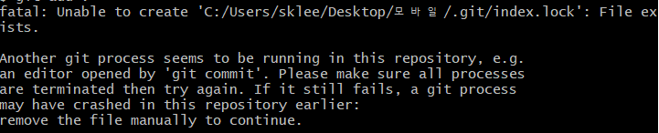

git을 사용해  gihub에 파일을 업로할때
`git commit -m "이름" `해당 코드에서 `-m`을 빼먹음으로써 
.git 파일안에 있는 index.lock파일에 오류가 발생했음
그럼으로 인해 아래와 같은 사진이 출력됨

해당 오류가 나오면 `commit`및 `push`명령어가 실행되지 X

* [해결방법]
1. 문제가 생긴 Git저장소 폴더 상단으로 이동
2. 해당 폴더를 루트로 하여 Terminal및 컨맨트 툴을 이용해 `cd "git 저장소 폴더 경로"` 이 명령어를 통해 해당 폴더로 이동후
3. 문제가 되는 index.lock 파일을 `rm -f ./.git/index.lock`를 통해 삭제
4. 다시  `commit`및 `push`명령어가 실행